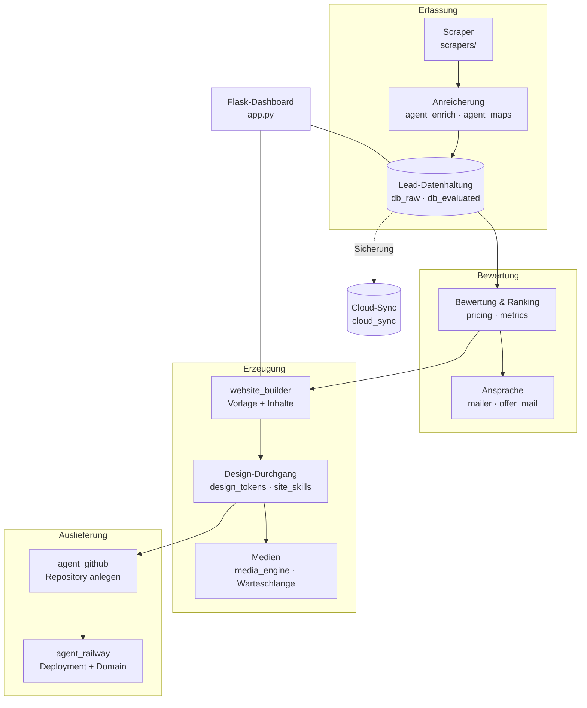

# JARVIS — Lead-Pipeline und Website-Generator

Eine selbst gebaute Plattform, die den kompletten Weg von der Lead-Recherche bis zur fertig deployten Kundenwebseite abdeckt: Betriebe finden, bewerten, anschreiben — und für interessierte Kunden auf Knopfdruck eine vollständige Django-Landingpage bauen und ausliefern.

Entstanden ist das aus einem sehr praktischen Problem. Ich baue Webseiten für kleine Betriebe. Der zeitaufwändigste Teil war nie das Programmieren, sondern alles drumherum: passende Betriebe finden, Kontaktdaten heraussuchen, Inhalte zusammentragen, Seite aufsetzen, deployen, Domain verbinden. JARVIS automatisiert genau diese Kette.

> **Status:** aktiv genutztes, aber gewachsenes Projekt. Was daran gut ist und was nicht, steht weiter unten unter [Ehrliche Einordnung](#ehrliche-einordnung).

---

## Was es tut

**Leads finden und bewerten** — Scraper sammeln Betriebe aus verschiedenen Quellen, reichern sie mit Kontaktdaten an und bewerten, wie lohnend ein Kontakt ist (hat der Betrieb überhaupt eine Webseite? wie alt wirkt sie?).

**Ansprache vorbereiten** — Angebots-Mails aus Vorlagen, Antwortvorschläge, Preisberechnung, Kostenverfolgung pro Vorgang.

**Webseiten bauen** — aus einer Vorlage plus recherchierten Inhalten entsteht eine vollständige Django-Seite: Texte, Bilder, Design-Durchgang, Feinschliff.

**Ausliefern** — GitHub-Repository anlegen, auf Railway deployen, Domain verbinden. Ohne manuellen Zwischenschritt.

**Medien erzeugen** — Werbevideos und Bildmaterial für die generierten Seiten, inklusive Warteschlange für längere Renderjobs.

---

## Architektur



---

## Technik

| Bereich | Eingesetzt |
|---|---|
| Backend | Python, Flask, Server-Sent Events für Live-Fortschritt |
| Scraping | Playwright, Selenium, cloudscraper, curl_cffi, BeautifulSoup |
| Erzeugte Seiten | Django, Gunicorn, Whitenoise |
| Automatisierung | GitHub-API, Railway-API |
| Medien | ffmpeg, Text-to-Speech, Bildverarbeitung |
| Datenhaltung | SQLite lokal, Cloud-Sync zur Sicherung |

---

## Aufbau

```
app.py                Flask-Backend und Dashboard
scrapers/             Quellen-Scraper und Steuerung
agents/               Fachagenten (Maps, GitHub, Railway, Medien, Shop)
leadpackages/         Verkauf fertiger Datenpakete
website_builder.py    Erzeugung kompletter Django-Seiten
media_engine.py       Video- und Bilderzeugung mit Warteschlange
vorlage_landing/      Grundvorlage der generierten Seiten
tests/                258 Testfunktionen
```

---

## Ehrliche Einordnung

Das Projekt ist mein umfangreichstes — und gleichzeitig das, an dem meine handwerklichen Schwächen am deutlichsten sichtbar sind. Beides gehört hierher.

**Was gut funktioniert:** Die Kette von der Recherche bis zum Deployment läuft wirklich durch. Die Aufteilung in Fachagenten hat sich getragen, als neue Quellen und Ausgabewege dazukamen. Geheimnisse liegen ausschließlich in einer `.env`, die nie eingecheckt wurde.

**Was nicht gut ist:**

- **Testabdeckung.** `258` Testfunktionen auf `44.285` Zeilen, konzentriert in vier Dateien. Große Teile sind ungetestet.
- **Kein Docker, keine CI.** Der Start hängt an einer lokal korrekt eingerichteten Umgebung.
- **Kein Linting, keine Typannotationen.** Bei `189` Modulen kostet das bei jeder Änderung Zeit.
- **`app.py` ist zu groß.** Zuständigkeiten gehören sauberer geschnitten.

Daran arbeite ich gerade — Tests und CI zuerst, weil ohne sie jede Umstrukturierung ein Risiko ist.

---

## Einrichtung

```bash
git clone https://github.com/BastianScherzinger/jarvis2.git
cd jarvis2
pip install -r requirements.txt
cp .env.example .env      # Zugangsdaten eintragen
python app.py
```

Alle benötigten Umgebungsvariablen sind in `.env.example` dokumentiert. Ohne gültige API-Zugänge laufen nur die lokalen Teile.

---

Gebaut von [Bastian Scherzinger](https://github.com/BastianScherzinger).
